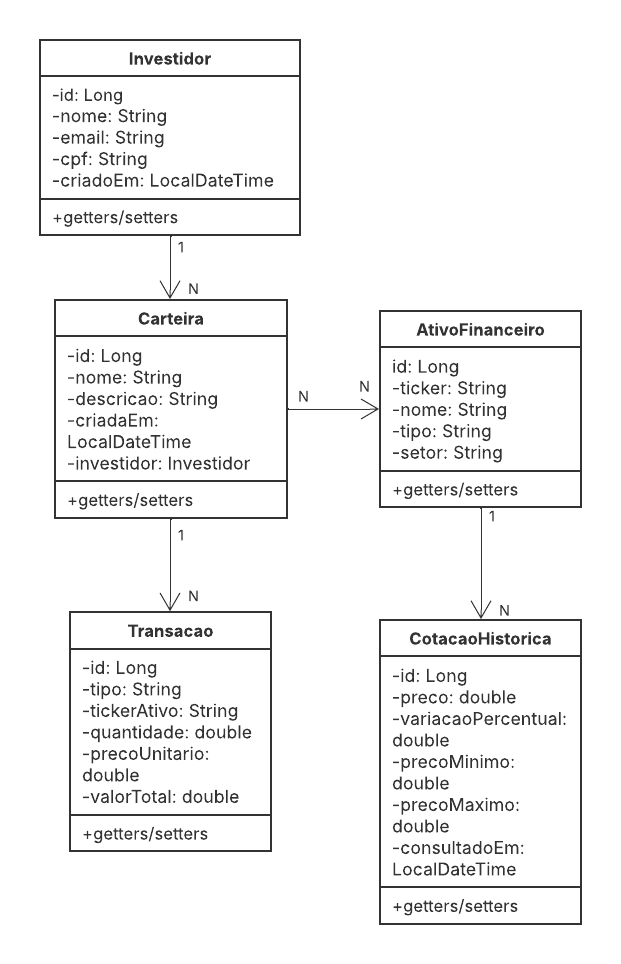

# Monitor de Investimentos

Sistema backend desenvolvido em Java com Spring Boot para simular e gerenciar uma carteira de investimentos de forma automatizada.

A aplicação permite o cadastro de investidores, criação de carteiras e registro de operações de compra e venda de ativos. O sistema é integrado com a API HG Brasil Finance, que fornece cotações atualizadas em tempo real.

---

## Como rodar

**1. Baixe o repositório**

Acesse o repositório no GitHub, clique no botão 'Code', selecione Download ZIP
e extraia o arquivo em uma pasta de sua preferência.

**2. Execute o projeto**

Abra o projeto na sua IDE (IntelliJ, Eclipse ou VS Code) e execute a classe principal: 'ApiApplication.java'

Aguarde a mensagem `Started ApiApplication` aparecer no console.

**3. Acesse o Swagger**

http://localhost:8080/swagger-ui.html

**4. Acesse o banco de dados H2**

http://localhost:8080/h2-console

- JDBC URL: `jdbc:h2:mem:investdb`
- Usuário: `sa`
- Senha: *(deixar em branco)*

---

## Fluxo de uso

Execute nessa ordem para ver tudo funcionando:

**1. Criar um investidor**
```
POST /investidores
{ "nome": "Nome", "email": "email@email.com", "cpf": "123.456.789-00" }

---
**2. Criar uma carteira**

POST /carteiras
{ "nome": "Carteira Renda", "descricao": "Renda", "investidor": { "id": 1 } }
---

**3. Cadastrar um ativo** *(a cotação é buscada automaticamente na API HG Brasil)*

POST /ativos
{ "ticker": "PETR4", "nome": "Petrobras", "tipo": "ACAO", "setor": "Energia" }
---

**4. Vincular o ativo à carteira**

POST /carteiras/1/ativos/1
---

**5. Registrar uma compra**

POST /transacoes
{
  "tipo": "COMPRA",
  "tickerAtivo": "PETR4",
  "quantidade": 100,
  "precoUnitario": 38.50,
  "observacao": "Primeira compra",
  "carteira": { "id": 1 }
}
---

**6. Ver o relatório com cotações ao vivo**

GET /carteiras/1/relatorio

---

# Diagrama de Classes do Projeto
<p align="center">
  
</p>

